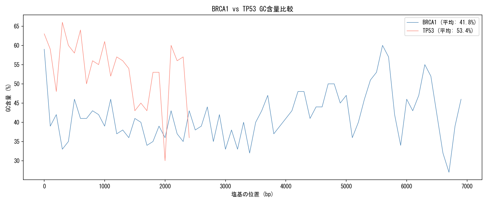
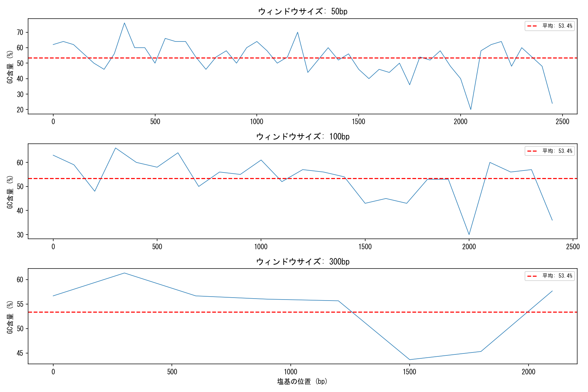
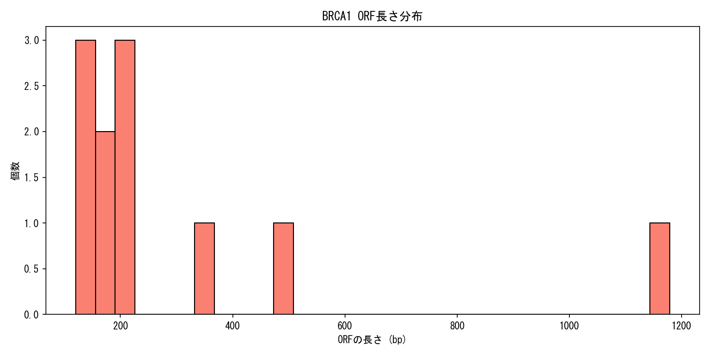

# BRCA1/TP53 ゲノム解析ツール

NCBIの公開データを使ってGC含量とORFを解析・可視化するPythonスクリプトです。

## 使い方

```bash
py brca1_analysis.py
```

## 出力されるファイル

### BRCA1 vs TP53 GC含量比較


### GC含量分布（ウィンドウサイズ比較）


### ORF長さ分布


## 解析結果
| 遺伝子 | 配列長 | 平均GC含量 |
|--------|--------|-----------|
| BRCA1  | 7088bp | 41.8%     |
| TP53   | 2629bp | 53.4%     |

## 使用ライブラリ

- BioPython
- matplotlib
- pandas