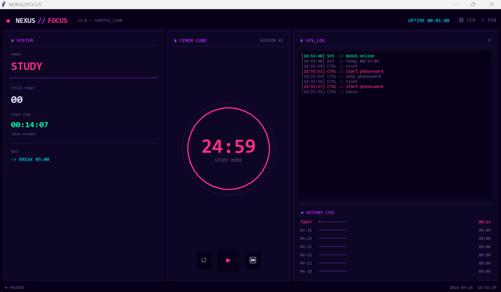

# NEXUS//FOCUS

> 広告なし・サブスク不要の、サイバーパンク風ポモドーロタイマー。  
> 「勉強中に、広告などにより気が散るアプリを使いたくない」という理由だけで作りました。


**[English README is here → README_EN.md](./README_EN.md)**

---

## 作った理由

既存のポモドーロアプリは広告が多いです。また、サブスクが必要、ブラウザのタブを占領するなど何かと邪魔でした。  
画面に常駐させておけて、SF映画の制御室みたいな見た目で、余計な通知が来ない——そういうものが欲しくて自作しました。

---

## スクリーンショット

---

## 機能一覧

| 機能 | 詳細 |
|---|---|
| ⏱ ポモドーロサイクル | 25分勉強 → 5分休憩を自動切替 |
| 📊 3パネルレイアウト | システム情報 / タイマーリング / ログ＋履歴 |
| 💾 日次ログの永続保存 | 勉強時間を `~/.nexus_focus_log.json` に保存（休憩時間は除外） |
| 📅 7日間の履歴表示 | 過去1週間の勉強時間をバーグラフで表示 |
| 🔄 日付をまたいだ自動リセット | 起動したまま深夜を越えても正しくリセットされる |
| 📌 常に最前面表示 | ワンクリックで他のウィンドウの上に固定 |
| 🎨 カラーカスタマイズ | UIの全色を設定画面から変更可能 |
| 🖥 操作ログ表示 | 開始・一時停止・サイクル完了などをリアルタイム表示 |
| ⚙ 追加インストール不要 | 標準ライブラリのみ使用 |

---

## 使い方

```bash
# リポジトリをクローン
git clone https://github.com/YOUR_USERNAME/nexus-focus.git
cd nexus-focus

# 実行（Python 3.8以上、追加パッケージ不要）
python nexus_focus.py
```

> **Windows**: [python.org](https://www.python.org/downloads/) からインストール  
> **Mac / Linux**: Tkinterが入っていない場合は `sudo apt install python3-tk`

---

## 操作

| ボタン | 動作 |
|---|---|
| `▶` | タイマー開始 |
| `❚❚` | 一時停止 |
| `↺` | 現在のフェーズをリセット |
| `⏭` | 次のフェーズへスキップ |
| `◇ PIN` | 常に最前面表示のON/OFF |
| `⚙ CFG` | カラー設定を開く |

勉強時間は自動で記録されます。休憩は含まれません。  
ログは30秒ごと＋終了時に自動保存されます。

---

## ファイル構成

```
nexus-focus/
├── nexus_focus.py   # アプリ本体（単一ファイル）
├── README.md
├── README_EN.md
└── .gitignore
```

ログデータは `~/.nexus_focus_log.json` に保存されるため、個人データがリポジトリに含まれません。

---

## 技術的なポイント

- **レイアウト管理**：縦方向は `pack`、3カラム分割は `grid` と使い分け、同一親ウィジェット内での混在を避けることでTkinterのレイアウトバグを防いでいます。
- **カラー管理**：ウィジェット生成時に色の役割をバインディング登録し、`_apply_colors()` で一括更新する仕組みにより、UI再構築なしで色変更に対応しています。
- **タイマー制御**：`after(1000, _tick)` の再帰呼び出しにポーズ時のキャンセル処理を組み合わせ、多重スケジュールによるズレを防止しました。
- **データ永続化**：日付をキーにしたJSONファイルに保存。30秒ごとの自動保存と終了時保存を併用しています。

---

## 開発について

[Claude](https://claude.ai)（Anthropic）を活用して開発しました。  
機能仕様・設計判断・デバッグ方針は自分で行い、実装にAIを使用しました。

---

## ライセンス

MIT
