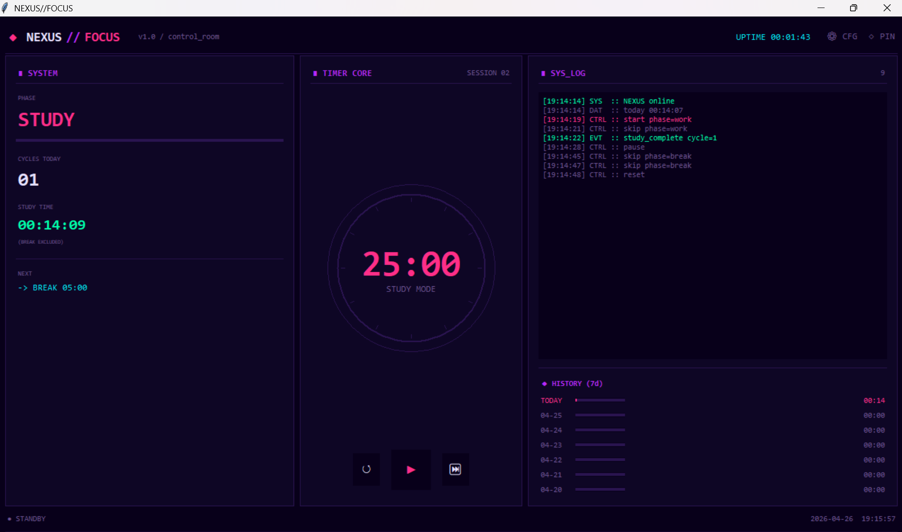

# NEXUS//FOCUS

> A cyberpunk-themed Pomodoro timer — no ads, no subscriptions, no browser tabs.  
> Built because every existing focus app was getting in the way of actually focusing.


**[日本語版はこちら → README.md](./README.md)**

---

## Motivation

Most Pomodoro apps are cluttered with ads, require subscriptions, or live in a browser tab that competes for attention.  
I wanted something that runs quietly in the corner of my screen, looks like a sci-fi control room, and just works — so I built it.

---

## Screenshot
Study mode:


Break mode:


---

## Features

| Feature | Details |
|---|---|
| ⏱ Pomodoro cycle | 25 min study → 5 min break, auto-switching |
| 📊 3-panel layout | System info / Timer ring / Live log + history |
| 💾 Persistent daily log | Study time saved to `~/.nexus_focus_log.json` (breaks excluded) |
| 📅 7-day history | Bar graph of daily study hours in the sidebar |
| 🔄 Midnight auto-reset | Detects date change and resets counter without restarting |
| 📌 Always-on-top pin | One-click toggle to keep the window above all others |
| 🎨 Full color customization | Every UI color editable via settings dialog |
| 🖥 Operation log | Real-time log of start, pause, cycle complete events |
| ⚙ Zero dependencies | Standard library only — no pip install needed |

---

## Getting Started

```bash
# Clone the repository
git clone https://github.com/YOUR_USERNAME/nexus-focus.git
cd nexus-focus

"# Run (Python 3.8+ required, no additional packages)
python nexus_focus.py
```

> **Windows**: Download from [python.org](https://www.python.org/downloads/)  
> **Mac / Linux**: If Tkinter is missing: `sudo apt install python3-tk`

---

## Controls

| Button | Action |
|---|---|
| `▶` | Start timer |
| `❚❚` | Pause |
| `↺` | Reset current phase |
| `⏭` | Skip to next phase |
| `◇ PIN` | Toggle always-on-top |
| `⚙ CFG` | Open color settings |

Study time is tracked automatically. Breaks are not counted.  
Log is auto-saved every 30 seconds and on exit.

---

## File Structure

```
nexus-focus/
├── nexus_focus.py   # Entire application (single file)
├── README.md        # Japanese
├── README_EN.md     # English
└── .gitignore
```

Log data is stored at `~/.nexus_focus_log.json` — personal data never enters the repository.

---

## Technical Notes

- **Layout**: `pack` for vertical stacking, `grid` for the 3-column split — never mixed within the same parent widget, which is a common source of Tkinter layout bugs
- **Color system**: Widgets register their color roles at build time; `_apply_colors()` replays all bindings on change without rebuilding the UI
- **Timer loop**: `after(1000, _tick)` with explicit cancel-on-pause prevents duplicate scheduling and timer drift
- **Persistence**: JSON keyed by date (`YYYY-MM-DD`), written every 30 seconds and on close

---

## Development

Built with the assistance of [Claude](https://claude.ai) (Anthropic).  
Feature design, architectural decisions, and debugging direction by me; implementation with AI.

---

## License

MIT
